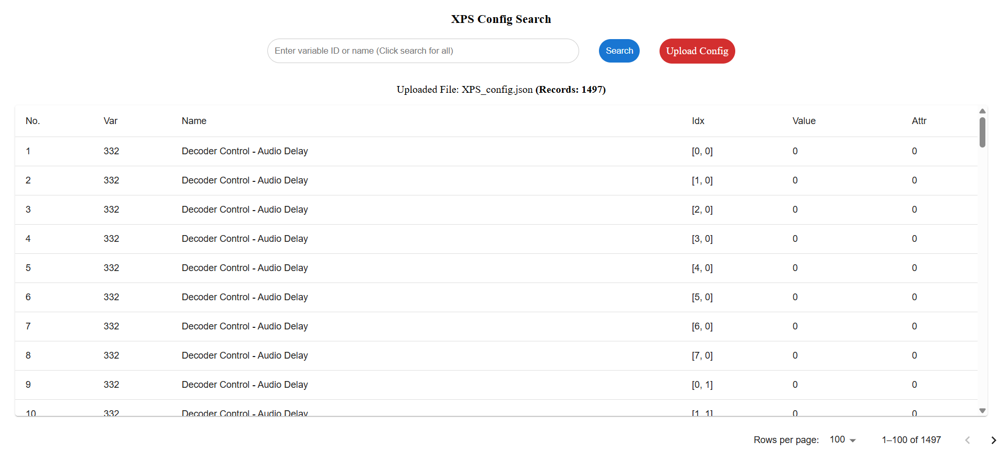

# XPS Config Search

XPS Config Search is a web application designed to help users easily view, search, and analyze XPS (XML Paper Specification) configuration data. Users can upload a configuration file in JSON format, and the application will display the data in a structured, searchable table.

## Screenshot

```

```
*The image should show the main interface, including the search bar, upload button, and the data table.*

## Features

*   **Upload JSON Configuration:** Easily upload XPS configuration files in `.json` format using the "Upload Config" button. The application expects a `config` array within the JSON.
*   **Dynamic Data Loading:** Initially loads a default dataset and seamlessly switches to user-uploaded data.
*   **Comprehensive Search:**
    *   Search by numeric variable ID (e.g., "332").
    *   Perform case-insensitive text search by variable name (e.g., "Decoder Control").
    *   View all configurations by leaving the search field empty and clicking "Search".
*   **Interactive Tabular Display:**
    *   Presents configuration data in a clear, paginated table with columns: No., Var, Name, Idx, Value, and Attr.
    *   The `Idx` and `Value` fields are formatted for readability using [`formatIdx`](src/components/SearchConfig.js) and [`formatParamValue`](src/components/SearchConfig.js).
*   **File Information:** Displays the name of the currently loaded configuration file and the total number of records.
*   **User Feedback:** Provides alerts for invalid JSON format, missing 'config' parameter, or unsupported file types. Shows a "No Data Found" message if search yields no results.
*   **Responsive Interface:** The layout adapts to different screen sizes, with the table content being scrollable.

## Getting Started

These instructions will get you a copy of the project up and running on your local machine for development and testing purposes.

### Prerequisites

*   Node.js and npm (or yarn) installed.

### Installation

1.  Clone the repository or download the project files.
2.  Navigate to the project directory:
    ```sh
    cd your-project-directory
    ```
3.  Install the dependencies:
    ```sh
    npm install
    ```
    or if you use yarn:
    ```sh
    yarn install
    ```

### Running the Application

To run the app in development mode:

```sh
npm start
```

This will open the application in your browser at [http://localhost:3000](http://localhost:3000). The page will reload if you make edits.

## Available Scripts

In the project directory, you can run:

*   `npm start`: Runs the app in development mode.
*   `npm test`: Launches the test runner in interactive watch mode.
*   `npm run build`: Builds the app for production to the `build` folder.
*   `npm run eject`: Removes the single build dependency and copies configuration files and dependencies into your project. **Note: this is a one-way operation.**

## How It Works

The core functionality is handled by the [`SearchConfig`](src/components/SearchConfig.js) component:

1.  **File Upload (`handleFileChange`):**
    *   When a user selects a JSON file, the [`handleFileChange`](src/components/SearchConfig.js) function is triggered.
    *   It uses `FileReader` to read the file content.
    *   It parses the JSON and validates that a `config` key exists.
    *   The uploaded file information is stored in the component's state.
2.  **Search (`handleSearch`):**
    *   Users can input a variable ID or name into the search field.
    *   The [`handleSearch`](src/components/SearchConfig.js) function filters the data from the uploaded JSON.
    *   If the query is empty, all data is shown.
    *   If the query is a number, it matches against the `var` field.
    *   If the query is text, it performs a case-insensitive search against the `name` field in the dataset.
3.  **Display:**
    *   Results are displayed in a paginated table using Material-UI components.
    *   The number of records and uploaded file name are shown.
    *   If no data matches the search, a "No Data Found" message is displayed.

The main application component is [`App.js`](src/App.js), which renders the [`SearchConfig`](src/components/SearchConfig.js) component. The application's entry point is [`src/index.js`](src/index.js). Styles are primarily managed in [`src/styles/SearchConfig.css`](src/styles/SearchConfig.css) and [`src/App.css`](src/App.css). An example dataset can be found at [`public/json/570XPS_dataset_final.json`](public/json/570XPS_dataset_final.json).

## Building for Production

To build the app for production:

```sh
npm run build
```

This bundles React in production mode and optimizes the build for the best performance. The build artifacts will be stored in the `build/` directory.

For more information on Create React App, see the